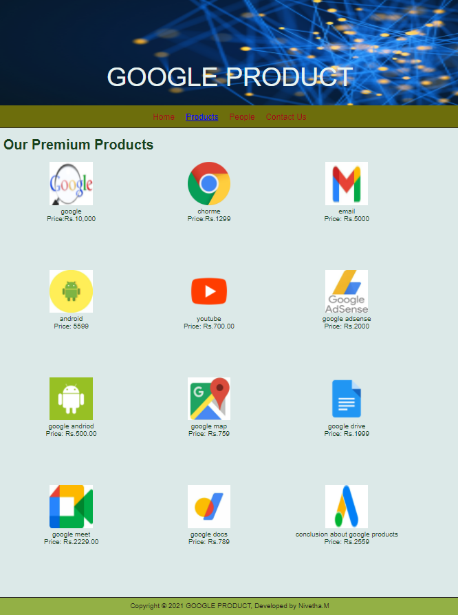

# Web Design for a Software Product Company

## AIM:

To design a static website for a software product company company.

## DESIGN STEPS:

### Step 1:

Requirement collection.

### Step 2:

Creating the layout using HTML and CSS.

### Step 3:

Updating the sample content.

### Step 4:

Choose the appropriate style and color scheme.

### Step 5:

Validate the layout in various browsers.

### Step 6:

Validate the HTML code.

### Step 6:

Publish the website in the given URL.

## PROGRAM :
Home coding:
```
<!DOCTYPE html>
<html lang="en">
  <head>
    <title>GOOGLE PRODUCT</title>
    <link rel="stylesheet" href="./css/layout.css" />
    <link rel="icon" href="./img/icon2.png" type="image/x-icon" />
  </head>

  <body>
    <div class="container">
      <div class="banner">GOOGLE PRODUCT</div>
      <div class="menu">
        <div class="menuitemselected"><a href="/static/home.html">Home</a></div>
        <div class="menuitem"><a href="/static/products.html">Products</a></div>
        <div class="menuitem"><a href="/static/people.html">People</a></div>
        <div class="menuitem"><a href="/static/contact us.html">Contact Us</a></div>
      </div>
      <div class="content">
        <div class="homecontent">
          <h1>About Us</h1>
          
          <div class="contenttext">
            Welcome to GOOGLE PRODUCTS!
             Google products is an online bookstore with a mission to financially support local, 
             independent bookstores.
             We believe that bookstores are essential to a healthy culture. 
             They’re where authors can connect with readers, 
             where we discover new writers, where children get hooked on the thrill of 
             reading that can last a lifetime. They’re also anchors for our downtowns and communities.
            <br />
            We hope that Bookshop can help strengthen the fragile ecosystem and margins around bookselling 
            and keep local bookstores an integral part of our culture and communities.
            Bookshop is a benefit corporation - a corporation dedicated to the public good.
            <ul>
              <li>Simple to learn, easier to use</li>
              <li>Note worthy books </li>
              <li>Anywhere, anytime access</li>
            </ul>
          </div>
        </div>
      </div>
      <div class="footer">
        Copyright &#169; 2021 GOOGLE PRODUCT, Developed by NIVETHA
      </div>
    </div>
  </body>
</html>
```
product coding:
```
<!DOCTYPE html>
<html lang="en">
  <head>
    <title>GOOGLE PRODUCT</title>
    <link rel="stylesheet" href="./css/layout.css" />
    <link rel="icon" href="./img/icon2.png" type="image/x-icon" />
  </head>

  <body>
    <div class="container">
      <div class="banner">GOOGLE PRODUCT</div>
      <div class="menu">
        <div class="menuitem"><a href="/static/home.html">Home</a></div>
        <div class="menuitemselected"><a href="/static/products.html">Products</a></div>  
        <div class="menuitem"><a href="/static/people.html">People</a></div>
        <div class="menuitem"><a href="/static/contact us.html">Contact Us</a></div>
      </div>
      <div class="content">
        <div class="productcontent">    
          <h1>Our Premium Products</h1>
          <div class="productitems">

              <div class="productitem"> 
                  <div class="itemimage">
                  
                  </div>
                  <div class="itemname">google</div>
                  <div class="itemprice">Price:Rs.10,000</div>
              </div>

              <div class="productitem"> 
                  <div class="itemimage">
                  
                  </div>
                  <div class="itemname">chorme</div>
                  <div class="itemprice">Price:Rs.1299</div>
              </div>

              <div class="productitem"> 
                  <div class="itemimage">
                  
                  </div>
                  <div class="itemname">email</div>
                  <div class="itemprice">Price: Rs.5000 </div>
              </div>

              <div class="productitem"> 
                <div class="itemimage">
                
                </div>
                <div class="itemname">android</div>
                <div class="itemprice">Price: 5599 </div>
            </div>

            <div class="productitem"> 
              <div class="itemimage">
              
              </div>
              <div class="itemname">youtube</div>
              <div class="itemprice">Price: Rs.700.00 </div>
          </div>

          <div class="productitem"> 
            <div class="itemimage">
              
            </div>
            <div class="itemname">google adsense</div>
            <div class="itemprice">Price: Rs.2000 </div>
        </div>

        <div class="productitem"> 
          <div class="itemimage">
          
          </div>
          <div class="itemname">google andriod</div>
          <div class="itemprice">Price: Rs.500.00 </div>
      </div>

      <div class="productitem"> 
        <div class="itemimage">
        
        </div>
        <div class="itemname">google map</div>
        <div class="itemprice">Price: Rs.759 </div>
    </div>

    <div class="productitem"> 
      <div class="itemimage">
      
      </div>
      <div class="itemname">google drive</div>
      <div class="itemprice">Price: Rs.1999 </div>
    </div>

    <div class="productitem"> 
       <div class="itemimage">
       
       </div>
       <div class="itemname">google meet</div>
       <div class="itemprice">Price: Rs.2229.00 </div>
    </div>
    <div class="productitem"> 
      <div class="itemimage">
      
    </div>
       <div class="itemname">google docs </div>
       <div class="itemprice">Price: Rs.789 </div>
    </div>

    <div class="productitem"> 
      <div class="itemimage">
      
     </div>
        <div class="itemname">conclusion about google products</div>
        <div class="itemprice">Price: Rs.2559 </div>
      </div>
    </div>
  </div>        
  </div>
    <div class="footer">
      Copyright &#169; 2021 GOOGLE PRODUCT, Developed by Nivetha.M
    </div>
  </div>
 </body>
</html>
```
people coding:
```
<!DOCTYPE html>
<html lang="en">
  <head>
    <title>GOOGLE PRODUCTS</title>
    <link rel="stylesheet" href="./css/layout.css" />
    <link rel="icon" href="./img/icon2.png" type="image/x-icon" />
  </head>

  <body>
    <div class="container">
      <div class="banner">GOOGLE PRODUCTS</div>
      <div class="menu">
        <div class="menuitem"><a href="/static/home.html">Home</a></div>
        <div class="menuitem"><a href="/static/products.html">Products</a></div>  
        <div class="menuitemselected"><a href ="/static/people.html"></a>People</a></div>
        <div class="menuitem"><a href="/static/contact us.html">Contact Us</a></div>
      </div>
      <div class="productitem"> 
        <div class="itemimage">
        
      </div>
         <div class="itemname">HEAD of the company
           <br>
           (sakthi)
         </div>
      </div>
      <div class="productitem"> 
        <div class="itemimage">
        
      </div>
         <div class="itemname">Manager
           <br>
           (karthi)
         </div>
      </div>
      <div class="productitem"> 
        <div class="itemimage">
        
      </div>
         <div class="itemname">Assistant class <br>(lavanya)</div>
      </div>
      <div class="productitem"> 
        <div class="itemimage">
        
      </div>
         <div class="itemname">Product Department Head <br> (swathi)</div>
      </div>
      <div class="productitem"> 
        <div class="itemimage">
        
      </div>
         <div class="itemname">Deliver Department Head <br> (dev)</div>
      </div>
      <div class="productitem"> 
        <div class="itemimage">
        
      </div>
         <div class="itemname">Chennai Branch Head <br> (hari)</div>
      </div>
      <div class="footer">
        Copyright &#169; GOOGLE PRODUCTS, Developed by Nivetha.M
      </div>
    </div>
  </body>
</html>
```
contact coding:
```
<!DOCTYPE html>
<html lang="en">
  <head>
    <title>GOOGLE PRODUCTS</title>
    <link rel="stylesheet" href="./css/layout.css" />
    <link rel="icon" href="./img/icon2.png" type="image/x-icon" />
  </head>

  <body>
    <div class="container">
      <div class="banner">GOOGLE PRODUCTS</div>
      <div class="menu">
        <div class="menuitem"><a href="/static/home.html">Home</a></div>
        <div class="menuitem"><a href="/static/products.html">Products</a></div>  
        <div class="menuitemselected"><a href ="/static/people.html"></a>People</a></div>
        <div class="menuitem"><a href="/static/contact us.html">Contact Us</a></div>
      </div>
      <div class="productitem"> 
        <div class="itemimage">
        
      </div>
         <div class="itemname">HEAD of the company
           <br>
           (sakthi)
         </div>
      </div>
      <div class="productitem"> 
        <div class="itemimage">
        
      </div>
         <div class="itemname">Manager
           <br>
           (karthi)
         </div>
      </div>
      <div class="productitem"> 
        <div class="itemimage">
        
      </div>
         <div class="itemname">Assistant class <br>(lavanya)</div>
      </div>
      <div class="productitem"> 
        <div class="itemimage">
        
      </div>
         <div class="itemname">Product Department Head <br> (swathi)</div>
      </div>
      <div class="productitem"> 
        <div class="itemimage">
        
      </div>
         <div class="itemname">Deliver Department Head <br> (dev)</div>
      </div>
      <div class="productitem"> 
        <div class="itemimage">
        
      </div>
         <div class="itemname">Chennai Branch Head <br> (hari)</div>
      </div>
      <div class="footer">
        Copyright &#169; GOOGLE PRODUCTS, Developed by Nivetha.M
      </div>
    </div>
  </body>
</html>
```


## OUTPUT:





## Result:

Thus a website is designed for the software product company and the HTML,CSS code are validated.
